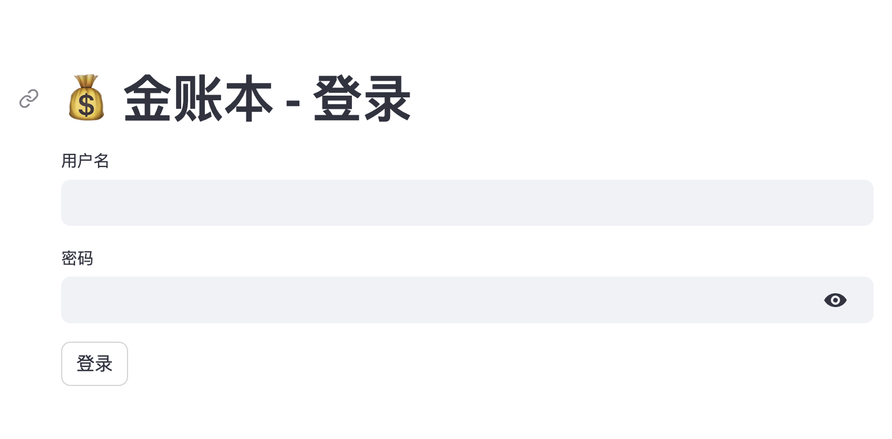
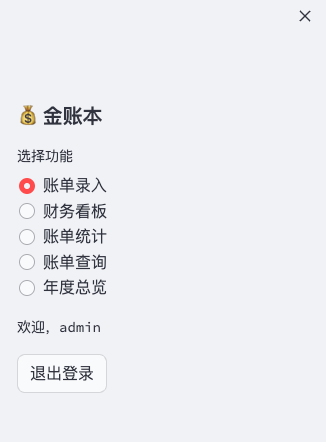
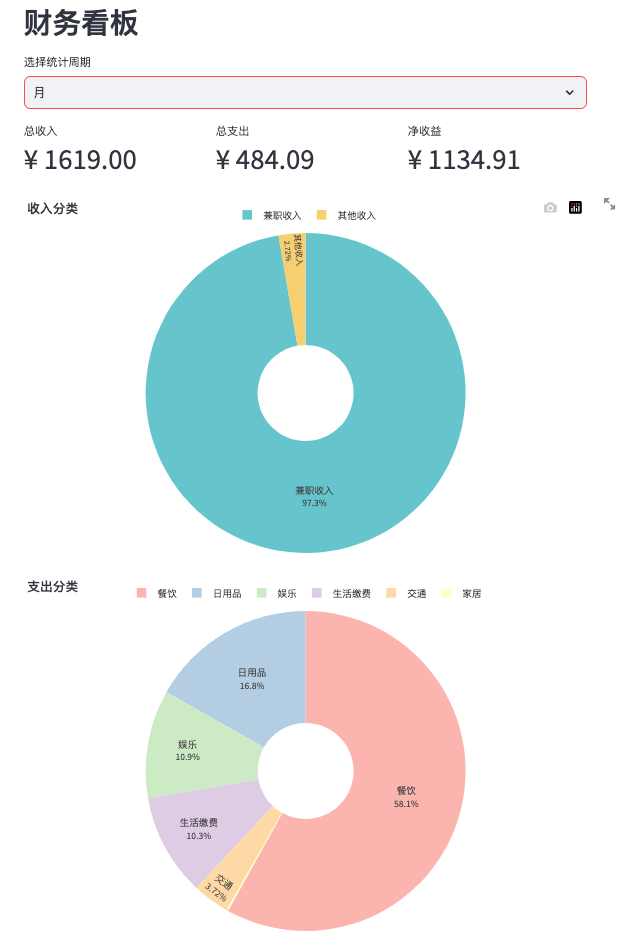
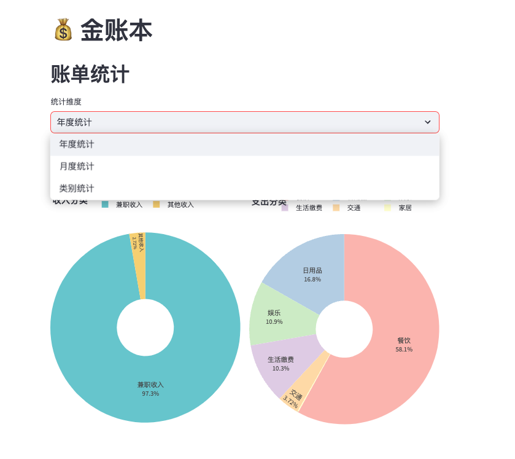
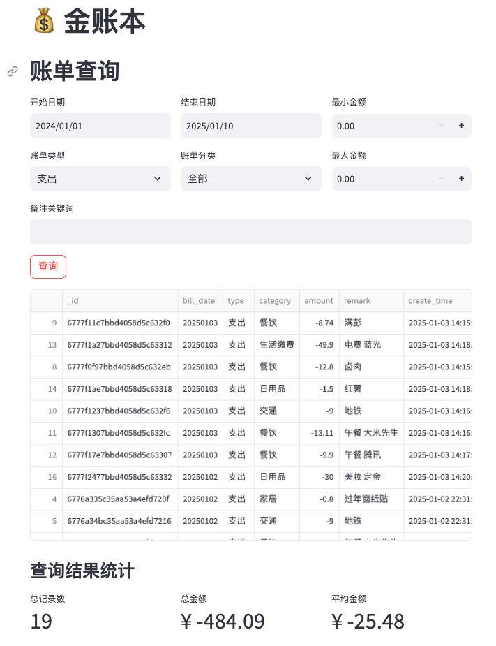
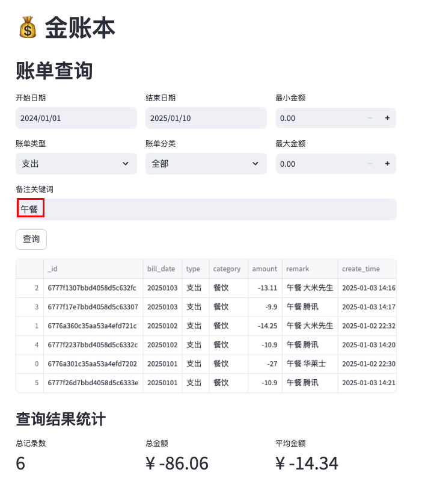
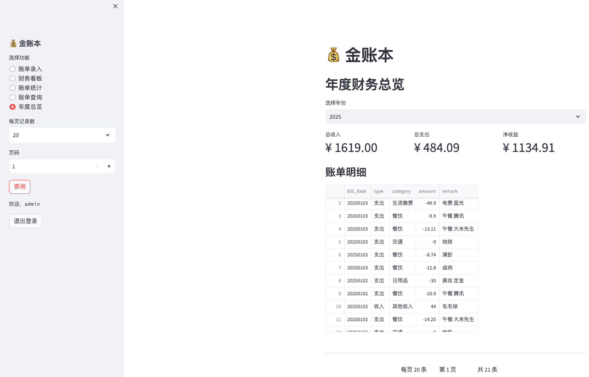

# 金账本 (Jinzhangben)

## 项目简介 (Project Overview)

金账本是一款个人财务管理应用，帮助用户轻松记录和追踪日常收支。

This is a personal finance management application built with Streamlit and MongoDB, helping users easily record, analyze, and track daily income and expenses.

## 项目展示

<details>
<summary>登录页面</summary>


</details>

<details>
<summary>导航栏</summary>


</details>

<details>
<summary>账单录入</summary>


</details>

<details>
<summary>财务看板</summary>


</details>

<details>
<summary>账单统计</summary>


</details>

<details>
<summary>账单查询</summary>



</details>

<details>
<summary>账单总览</summary>


</details>

## 技术栈 (Tech Stack)

- **前端框架**: Streamlit
- **数据库**: MongoDB
- **数据处理**: Pandas
- **数据可视化**: Plotly
- **日志**: Loguru
- **密码加密**: Bcrypt
- Python 3.9+
- Docker

## 快速开始 (Quick Start)

### 本地开发 (Local Development)

#### 环境准备
1. 克隆项目
```bash
git clone https://github.com/zjzjzjzj1874/python_bill.git
cd python_bill
```

2. 创建虚拟环境
```bash
python3 -m venv venv
source venv/bin/activate  # macOS/Linux
# venv\Scripts\activate  # Windows
```

3. 安装依赖
```bash
pip3 install -r requirements.txt
```

4. 启动应用
```bash
streamlit run app.py
```

### Docker 部署 (Docker Deployment)

#### 前提条件
- 安装 Docker
- 安装 Docker Compose

#### 部署步骤
1. 构建并启动容器
```bash
docker-compose up --build
```

2. 访问应用
- Web应用：`http://localhost:8501`
- MongoDB：内部服务，不对外暴露

#### 常用 Docker 命令
```bash
# 后台运行
docker-compose up -d

# 查看日志
docker-compose logs web

# 停止服务
docker-compose down
```

## 主要功能 (Key Features)

### 1. 用户认证 (User Authentication)
- 安全的用户登录和注册系统
- 使用 bcrypt 加密存储用户密码
- 保护个人财务数据隐私

### 2. 账单记录 (Bill Recording)
- 支持多种收入类型：
  - 兼职收入
  - 补贴
  - 其他收入

- 支持多种支出类型：
  - 餐饮
  - 羽毛球
  - 交通
  - 娱乐
  - 日用品
  - 生活缴费
  - 小车维护
  - 小车保险
  - 停车费
  - 服饰
  - 旅行
  - 书籍
  - 运动健身
  - 人情往来
  - 家居
  - 物业

### 3. 数据查询 (Data Query)
- 灵活的多条件账单查询
- 支持按日期范围、账单类型、金额范围等筛选
- 支持备注关键词模糊搜索

### 4. 财务分析 (Financial Analysis)
- 周、月、季度、年度财务总结
- 收支图表可视化
- 详细的财务指标展示

## 配置 (Configuration)

### 环境变量
- `MONGO_URI`：MongoDB 连接字符串
- 可在 `.env` 文件中配置

- 默认 MongoDB 地址: `localhost:27017`
- 日志文件位置: `logs/` 目录
- 用户信息存储: `users.json`

## 目录结构
```
jinzhangben/
│
├── app.py             # Streamlit 主应用
├── database.py        # 数据库交互
├── user_manager.py    # 用户管理
│
├── Dockerfile         # Docker 构建配置
├── docker-compose.yml # 服务编排
├── requirements.txt   # Python 依赖
│
└── README.md          # 项目文档
```

## 安全性 (Security)

- 用户密码使用 bcrypt 加密存储
- 日志记录包含 IP 地址信息
- 日志按天切割，保留最近 30 天记录

## 贡献指南 (Contributing)
1. Fork 项目
2. 创建功能分支 (`git checkout -b feature/AmazingFeature`)
3. 提交更改 (`git commit -m '添加了某某功能'`)
4. 推送到分支 (`git push origin feature/AmazingFeature`)
5. 提交 Pull Request

## 许可证 (License)
Apache License

## 联系 (Contact)

GitHub: [zjzjzjzj1874](https://github.com/zjzjzjzj1874)
