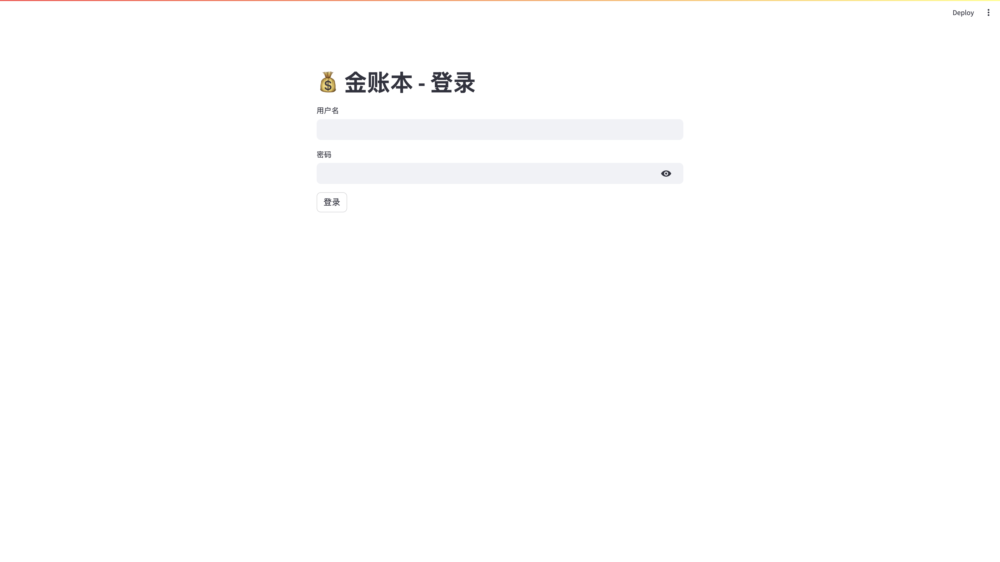
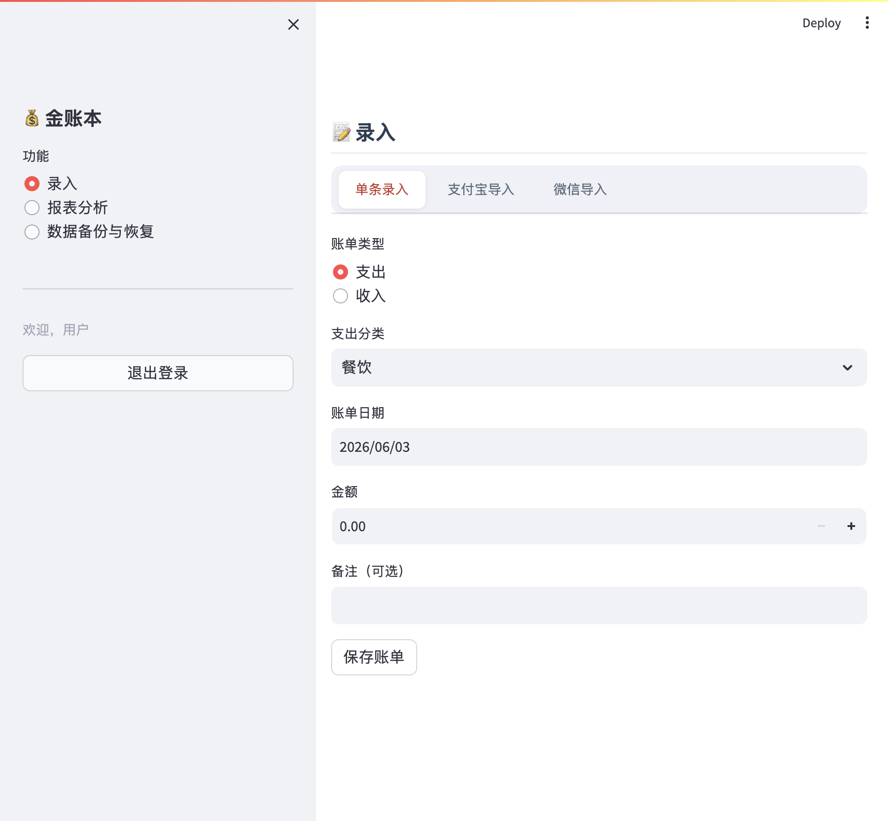
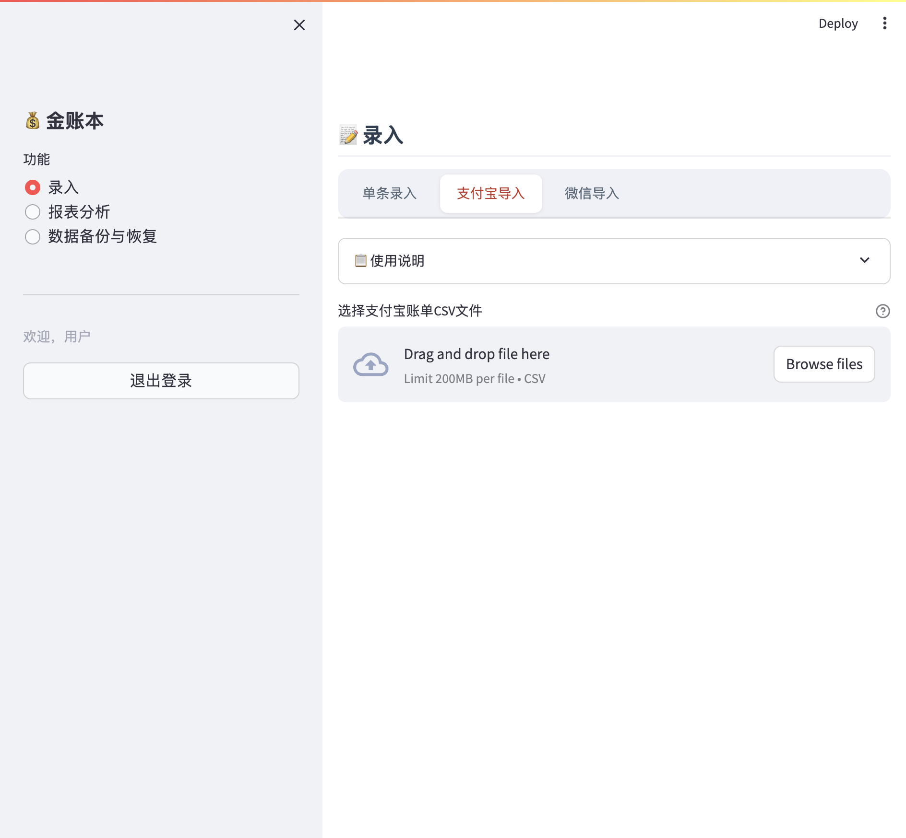
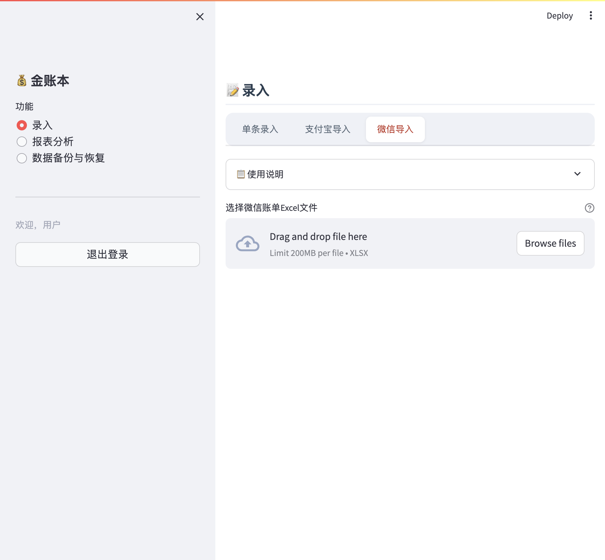
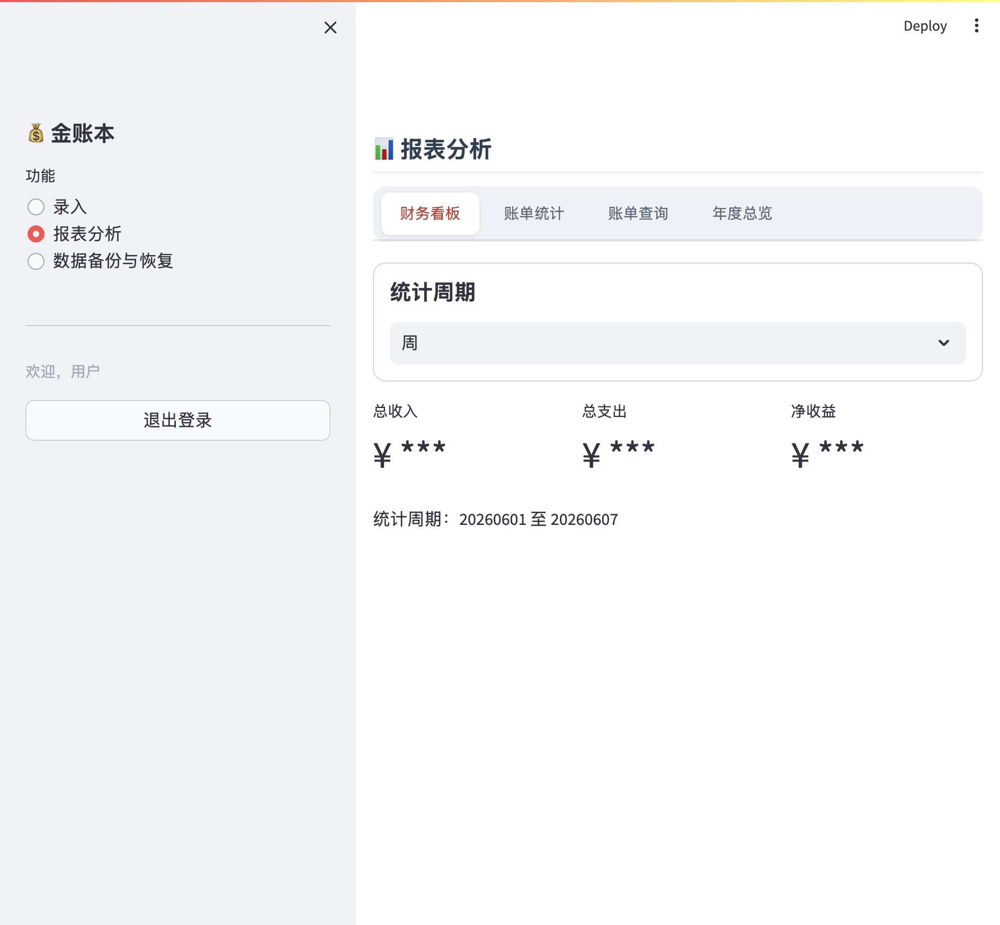
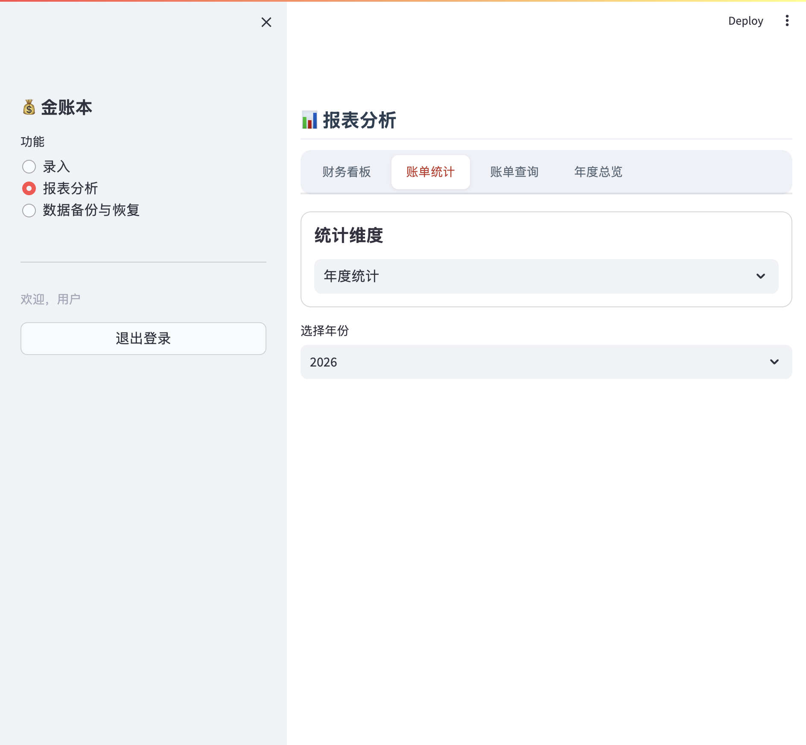
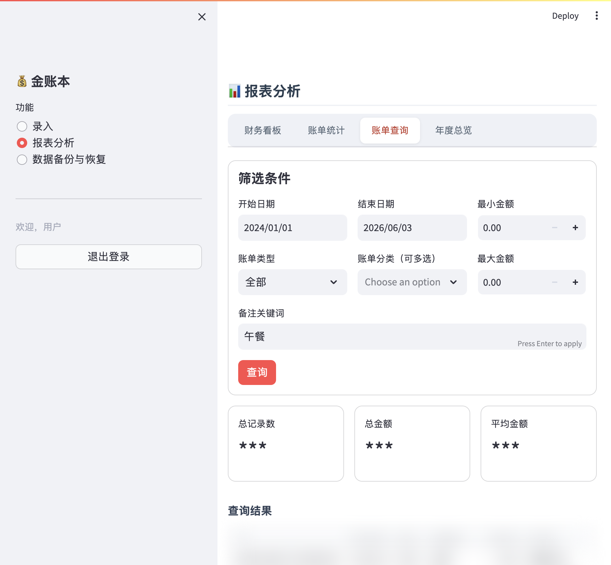
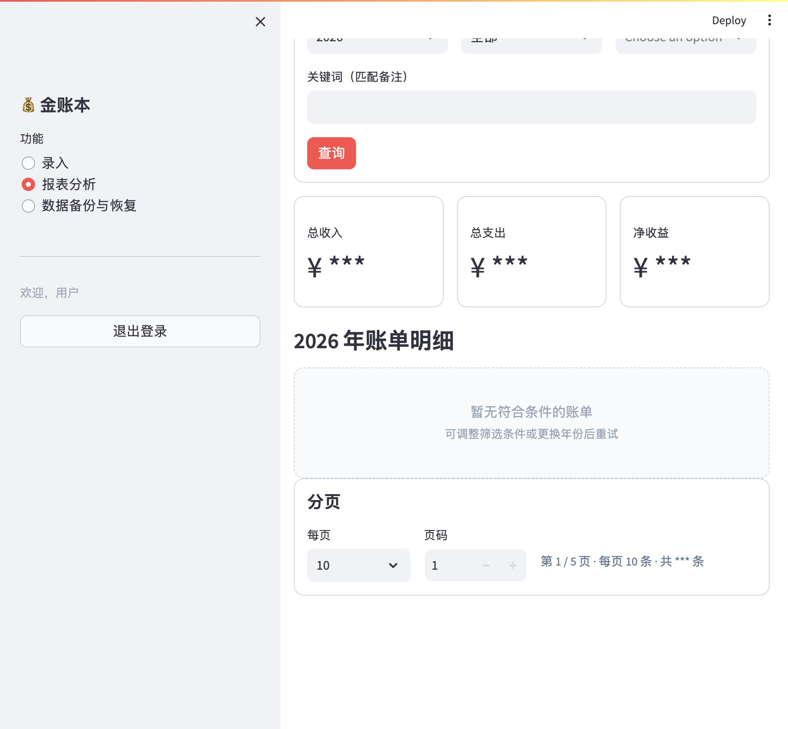
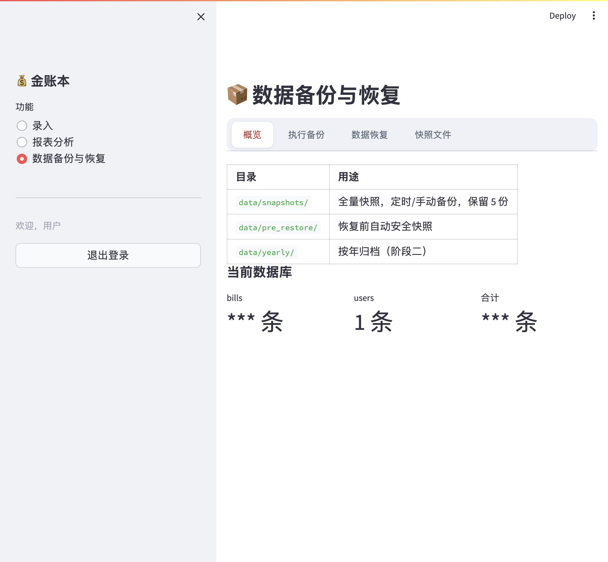

# 金账本 (Jinzhangben)

基于 **Streamlit + MongoDB** 的个人记账 Web 应用：记录收支、导入支付宝/微信账单、多维度报表分析，以及可恢复的 Mongo 快照备份。

## 功能结构

登录后，侧栏为三个主模块；各模块在主区域通过 Tab 切换子功能：

```
💰 金账本
├── 📝 录入
│   ├── 单条录入
│   ├── 支付宝导入（CSV）
│   └── 微信导入（XLSX）
├── 📊 报表分析
│   ├── 财务看板（周 / 月 / 季 / 年）
│   ├── 账单统计（年 / 月 / 类别）
│   ├── 账单查询（日期、类型、分类、金额、备注关键词）
│   └── 年度总览（年份 + 筛选；分页在页脚）
└── 📦 数据备份与恢复
    ├── 概览（库状态、目录说明）
    ├── 执行备份（智能 / 强制）
    ├── 数据恢复（bills_only / merge / full_replace）
    └── 快照文件（列表与下载）
```

**登录说明**：优先使用数据库中的密码；若库中尚无该用户，可使用 `users.json` 中的初始密码登录，系统会写入数据库并**强制修改密码**后方可继续使用。

## 界面预览

以下为 **现版 UI**（侧栏三模块 + 主区 Tab）截图，存放于 `static/`。预览中的**金额、账单明细与用户名已脱敏**（示例用户「用户」、金额显示为 `***` 或模糊处理），与真实数据无关。

<details>
<summary>登录</summary>


</details>

<details>
<summary>录入（侧栏 + Tab）</summary>







</details>

<details>
<summary>报表分析</summary>








</details>

<details>
<summary>数据备份与恢复</summary>


</details>

## 技术栈

| 类别 | 技术 |
|------|------|
| 应用 | Streamlit |
| 数据库 | MongoDB 7 |
| 数据处理 | Pandas |
| 图表 | Plotly |
| 认证 | bcrypt（`users.json` + 库内凭据） |
| 日志 | Loguru |
| 部署 | Docker Compose |

环境要求：**Python 3.9+**（本地开发）或 **Docker + Compose V2**（推荐生产）。

## 快速开始

### 1. 克隆与依赖

```bash
git clone https://github.com/zjzjzjzj1874/python_bill.git
cd python_bill   # 或你的目录名 bill-py-streamlit

python3 -m venv venv
source venv/bin/activate
pip install -r requirements.txt
```

### 2. 环境变量

```bash
cp .env.example .env
# 可选：MONGO_URI、MONGO_DB_NAME（默认 bill_tracker）
```

### 3. 用户凭据（必做）

`users.json` 含密码哈希，**不会**进入 Git。首次部署请：

```bash
cp users.json.example users.json
python addUser.py    # 交互式创建用户与 bcrypt 哈希
```

Docker 部署时 compose 会将 `./users.json` 挂载进容器，请在宿主机准备好该文件。

### 4. 本地运行（本机 MongoDB）

确保 MongoDB 已启动（默认 `localhost:27017`），然后：

```bash
streamlit run app.py
# 或
make build
```

浏览器访问：<http://localhost:8501>

<details>
<summary>安装 MongoDB（各系统）</summary>

```bash
# macOS (Homebrew)
brew tap mongodb/brew && brew install mongodb-community
brew services start mongodb-community

# Ubuntu
sudo apt-get install mongodb && sudo service mongodb start
```

Windows 请从 [MongoDB 官网](https://www.mongodb.com/try/download/community) 下载安装包。
</details>

### 5. Docker 部署（推荐）

```bash
# 准备 users.json、.env（可选）后
make run          # 启动 web + mongo + 定时 backup
```

| 服务 | 说明 |
|------|------|
| `web` | Streamlit，<http://localhost:8501> |
| `mongo` | 宿主机端口 **37017** → 容器 27017 |
| `backup` | 启动时备份一次，之后默认每 24 小时同步 Mongo → `./data` |

**改代码后务必重建镜像**（未挂载源码，仅 `restart` 不会更新逻辑）：

```bash
make rebuild      # 重建 web + backup
make logs         # 查看 web 日志
make backup-once  # 立即执行一次备份
make backup-logs  # 查看 backup 服务日志
make restart      # 仅重启 web（不加载新代码）
```

等价命令：

```bash
docker compose up -d --build web backup
```

## 功能说明

### 录入

- **单条录入**：选择收入/支出类型与分类（见 `bill_types.py`），填写日期、金额、备注。
- **支付宝导入**：上传 CSV；按对方名称、商品名称等规则自动分类；未命中规则的可人工确认后入库。
- **微信导入**：上传 XLSX（依赖 `openpyxl`）；支持收支类型识别与预览后导入。

**自定义分类关键词**（可选）：

```bash
cp classifier_keywords.example.json classifier_keywords.local.json
# 编辑后重启应用；local 文件已被 .gitignore，与内置通用词合并
```

### 报表分析

- **财务看板**：按周/月/季/年汇总收入、支出与图表。
- **账单统计**：年度、月度或按类别聚合。
- **账单查询**：日期范围、类型、多分类、金额区间、备注关键词。
- **年度总览**：按年查看 KPI（总收入/总支出/净收益）与明细分页；支持类型、分类（多选）、备注关键词筛选；**每页条数与页码在表格下方**，修改后自动刷新。

### 数据备份与恢复

数据目录（挂载在 `./data`，已在 `.gitignore`）：

| 路径 | 用途 |
|------|------|
| `data/snapshots/` | 定时/手动全量快照，默认保留最新 5 份 |
| `data/pre_restore/` | 执行恢复前自动写入的安全快照 |
| `data/manifest.json` | 最近一次备份/恢复事件元数据 |
| `data/yearly/` | 按年归档（预留） |

- **智能备份**：比对数据哈希，无变化则跳过。
- **强制备份**：忽略哈希检测，立即生成快照。
- **恢复模式**：
  - `bills_only`：仅恢复账单集合
  - `merge`：与现有数据合并
  - `full_replace`：全量替换（可选同时恢复 `users`）
- 恢复前会自动写入 `pre_restore/`；可用最近的安全快照回滚。

定时备份由 `backup` 服务执行 `scripts/backup-loop.sh`；本地也可：

```bash
python scheduled_backup.py
```

## 命令行导入（可选）

与 Web 录入 Tab 能力相同，适合批量或脚本化：

**支付宝**（CSV 放 `csv/ali/`）：

```bash
python import_alipay_bills.py
python import_alipay_bills.py your-alipay-bill.csv
```

必需列：`创建时间`、`商品名称`、`订单金额(元)`、`对方名称`（`分类` 可选）。

**微信**（XLSX 放 `csv/tencent/`）：

```bash
python import_wechat_bills.py csv/tencent/your-wechat-bill.xlsx
python import_wechat_bills.py csv/tencent/your-wechat-bill.xlsx --preview
```

必需列：`交易时间`、`交易对方`、`商品`、`收/支`、`金额(元)`（`分类` 可选）。

## 配置

| 变量 / 文件 | 说明 |
|-------------|------|
| `MONGO_URI` | MongoDB 连接串（Docker 内为 `mongodb://mongo:27017/`） |
| `MONGO_DB_NAME` | 库名，如 `bill_tracker` / `bill_tracker_test` |
| `users.json` | 初始用户哈希（勿提交仓库） |
| `classifier_keywords.local.json` | 私有导入分类词（勿提交仓库） |
| `DATA_DIR` / `LOG_DIR` | 备份脚本与 backup 服务使用，默认 `./data`、`./logs` |

日志按天写入 `logs/`，默认保留约 30 天。

## 目录结构

```
.
├── app.py                      # Streamlit 主应用（导航、各页面）
├── database.py                 # Mongo 访问、查询、备份与恢复
├── user_manager.py             # 登录与改密（库优先）
├── bill_types.py               # 收入/支出分类枚举
├── bill_classifier.py          # 导入分类（默认 + local 合并）
├── alipay_bill_processor.py
├── wechat_bill_processor.py
├── import_alipay_bills.py
├── import_wechat_bills.py
├── scheduled_backup.py
├── scripts/backup-loop.sh      # Docker backup 入口循环
├── data/                       # 快照与 manifest（运行时生成）
├── logs/
├── static/                     # README 截图等资源
├── users.json.example
├── classifier_keywords.example.json
├── Dockerfile
├── docker-compose.yml
├── Makefile
├── requirements.txt
└── .env.example
```

## 安全与开源注意

- 密码使用 bcrypt；`users.json` 与 `data/` 已忽略，勿将真实哈希提交到公开仓库。
- 备注模糊查询对正则特殊字符做了转义，降低注入/ReDoS 风险。
- Docker 镜像通过 `.dockerignore` 排除凭据与本地数据；凭据靠卷挂载持久化。
- 首次从 `users.json` 登录会落库并强制改密；数据库异常时**不会**回退到文件密码。

更详细的变更记录见 [CHANGELOG.md](./CHANGELOG.md)。

## 贡献与许可

1. Fork 本仓库  
2. 创建分支：`git checkout -b feature/your-feature`  
3. 提交改动并发起 Pull Request  

许可证：[Apache License](./LICENSE)

GitHub：[zjzjzjzj1874](https://github.com/zjzjzjzj1874)
