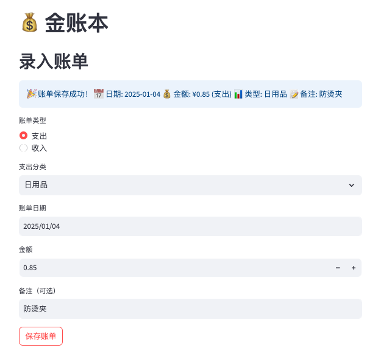

# 金账本 (Jinzhangben)

## 项目简介 (Project Overview)

金账本是一款个人财务管理应用，帮助用户轻松记录和追踪日常收支。

This is a personal finance management application built with Streamlit and MongoDB, helping users easily record, analyze, and track daily income and expenses.

## 项目展示

<details>
<summary>登录页面</summary>


</details>

<details>
<summary>导航栏</summary>


</details>

<details>
<summary>账单录入</summary>


</details>

<details>
<summary>财务看板</summary>


</details>

<details>
<summary>账单统计</summary>


</details>

<details>
<summary>账单查询</summary>


</details>

<details>
<summary>账单总览</summary>


</details>

<details>
<summary>支付宝账单导入</summary>


</details>

<details>
<summary>微信账单导入</summary>


</details>

## 技术栈 (Tech Stack)

- **前端框架**: Streamlit
- **数据库**: MongoDB
- **数据处理**: Pandas
- **数据可视化**: Plotly
- **日志**: Loguru
- **密码加密**: Bcrypt
- Python 3.9+
- Docker

## 快速开始 (Quick Start)

### 本地开发 (Local Development)

#### 环境准备
1. 克隆项目
```bash
git clone https://github.com/zjzjzjzj1874/python_bill.git
cd python_bill
```

2. 创建虚拟环境
```bash
python3 -m venv venv
source venv/bin/activate  # macOS/Linux
# venv\Scripts\activate  # Windows
```

3. 安装依赖
```bash
pip3 install -r requirements.txt
```

<details>
<summary>4. 配置 MongoDB</summary>

```bash
# 安装 MongoDB（根据操作系统选择对应命令）

# macOS (使用 Homebrew)
brew tap mongodb/brew
brew install mongodb-community

# Ubuntu
sudo apt-get install mongodb

# Windows
# 请访问 MongoDB 官网下载安装包：https://www.mongodb.com/try/download/community

# 启动 MongoDB 服务
# macOS
brew services start mongodb-community

# Ubuntu
sudo service mongodb start

# Windows
# 通过服务管理器启动 MongoDB 服务
```

> 注意：确保 MongoDB 服务正在运行，否则应用将无法正常工作。如需查看 MongoDB 服务状态：
> - macOS: `brew services list`
> - Ubuntu: `sudo service mongodb status`
> - Windows: 在服务管理器中查看 MongoDB 服务状态
</details>


5. 配置环境变量
```bash
# 复制环境变量示例文件
cp .env.example .env

# 编辑 .env 文件，根据需要修改配置
# 主要配置项：
# MONGO_URI=mongodb://localhost:27017/  # MongoDB连接URI（可选）
# MONGO_DB_NAME=bill_tracker            # 数据库名称
```

**环境配置说明：**
- `MONGO_DB_NAME`: 数据库名称，支持不同环境使用不同数据库
  - 生产环境：`bill_tracker`
  - 测试环境：`bill_tracker_test`
  - 开发环境：`bill_tracker_dev`

6. 启动应用
```bash
streamlit run app.py
```

### Docker 部署 (Docker Deployment)

#### 前提条件
- 安装 Docker
- 安装 Docker Compose

#### 部署步骤
1. 构建并启动容器
```bash
docker-compose up --build
```

2. 访问应用
- Web应用：`http://localhost:8501`
- MongoDB：内部服务，不对外暴露

#### 常用 Docker 命令
```bash
# 后台运行
docker-compose up -d

# 查看日志
docker-compose logs web

# 停止服务
docker-compose down
```

## 主要功能 (Key Features)

### 1. 用户认证 (User Authentication)
- 安全的用户登录和注册系统
- 使用 bcrypt 加密存储用户密码
- 保护个人财务数据隐私

### 2. 账单记录 (Bill Recording)
- 支持多种收入类型：
  - 兼职收入
  - 补贴
  - 其他收入

- 支持多种支出类型：
  - 餐饮
  - 羽毛球
  - 交通
  - 娱乐
  - 日用品
  - 生活缴费
  - 小车维护
  - 小车保险
  - 停车费
  - 服饰
  - 旅行
  - 书籍
  - 运动健身
  - 人情往来
  - 家居
  - 物业

### 3. 数据查询 (Data Query)
- 灵活的多条件账单查询
- 支持按日期范围、账单类型、金额范围等筛选
- 支持备注关键词模糊搜索

### 4. 支付宝账单导入 (Alipay Bill Import)
- 支持CSV格式的支付宝账单文件导入
- 智能自动分类功能，基于交易对方和商品名称
- 批量导入账单数据，提高录入效率
- 支持Web界面和命令行两种导入方式
- 数据预览功能，导入前可查看和确认
- 支持手动处理未分类账单

### 5. 微信账单导入 (WeChat Bill Import)
- 支持Excel格式的微信账单文件导入
- 智能自动分类功能，基于交易对方和商品描述
- 支持收入和支出两种类型的账单
- 批量导入账单数据，提高录入效率
- 支持Web界面和命令行两种导入方式
- 数据预览功能，导入前可查看分类结果
- 支持手动处理未分类账单
- 预览模式，可在不导入数据库的情况下查看处理结果

### 6. 财务分析 (Financial Analysis)
- 周、月、季度、年度财务总结
- 收支图表可视化
- 详细的财务指标展示

## 账单导入使用指南 (Bill Import Guide)

### 支付宝账单导入 (Alipay Import)

#### Web界面导入
1. 登录应用后，在侧边栏选择「支付宝账单导入」
2. 上传支付宝导出的CSV格式账单文件
3. 系统会自动预览和分类账单
4. 确认后点击导入按钮

#### 命令行导入
```bash
# 将支付宝账单CSV文件放在 csv/ali/ 目录下
mkdir -p csv/ali
cp your-alipay-bill.csv csv/ali/

# 使用默认文件名 zfb-bill.csv
python import_alipay_bills.py

# 或指定文件名
python import_alipay_bills.py your-alipay-bill.csv
```

#### 支持的文件格式
支付宝账单CSV文件必须包含以下列：
- `创建时间`: 交易时间
- `商品名称`: 交易描述
- `订单金额(元)`: 交易金额
- `对方名称`: 交易对方
- `分类`: 交易分类（可选）

#### 自动分类规则
- **交通**: 成都地铁运营有限公司
- **餐饮**: 四川乡村基餐饮有限公司、包含"外卖订单"、"咖啡"、"奶茶"、"零食"、"小吃"
- **日用品**: 包含"店内购物"、"满彭菜场"、"集刻便利店"
- 其他无法自动分类的账单会单独列出供手动确认

### 微信账单导入 (WeChat Import)

#### Web界面导入
1. 登录应用后，在侧边栏选择「微信账单导入」
2. 上传微信导出的Excel格式账单文件
3. 系统会自动预览和分类账单
4. 确认后点击导入按钮

#### 命令行导入
```bash
# 将微信账单Excel文件放在 csv/tencent/ 目录下
mkdir -p csv/tencent
cp your-wechat-bill.xlsx csv/tencent/

# 导入微信账单
python import_wechat_bills.py csv/tencent/your-wechat-bill.xlsx

# 预览模式（不导入数据库）
python import_wechat_bills.py csv/tencent/your-wechat-bill.xlsx --preview
```

#### 支持的文件格式
微信账单Excel文件必须包含以下列：
- `交易时间`: 交易时间
- `交易对方`: 交易对方
- `商品`: 交易描述
- `收/支`: 收入或支出类型
- `金额(元)`: 交易金额
- `分类`: 交易分类（可选）

#### 自动分类规则
- **交通**: 滴滴出行、哈啰出行、地铁、公交相关
- **餐饮**: 美团、饿了么、星巴克、肯德基、麦当劳等
- **日用品**: 永辉超市、沃尔玛、家乐福等
- **停车费**: 深圳市微泊云科技有限公司、华敏物业等
- **羽毛球**: 闪动体育科技、球馆相关
- **小车加油**: 壳牌等加油站
- **美妆**: 快剪等美容服务
- 其他无法自动分类的账单会单独列出供手动确认

## 配置 (Configuration)

### 环境变量
- `MONGO_URI`：MongoDB 连接字符串
- 可在 `.env` 文件中配置

- 默认 MongoDB 地址: `localhost:27017`
- 日志文件位置: `logs/` 目录
- 用户信息存储: `users.json`

## 目录结构
```
jinzhangben/
│
├── app.py                      # Streamlit 主应用
├── database.py                 # 数据库交互
├── user_manager.py             # 用户管理
│
├── alipay_bill_processor.py    # 支付宝账单处理器
├── wechat_bill_processor.py    # 微信账单处理器
├── import_alipay_bills.py      # 支付宝账单导入脚本
├── import_wechat_bills.py      # 微信账单导入脚本
│
├── csv/                        # 账单文件目录
│   ├── ali/                    # 支付宝账单文件
│   └── tencent/                # 微信账单文件
│
├── logs/                       # 日志文件目录
├── static/                     # 静态资源文件
│
├── Dockerfile                  # Docker 构建配置
├── docker-compose.yml          # 服务编排
├── requirements.txt            # Python 依赖
├── .env.example                # 环境变量示例
│
└── README.md                   # 项目文档
```

## 安全性 (Security)

- 用户密码使用 bcrypt 加密存储
- 日志记录包含 IP 地址信息
- 日志按天切割，保留最近 30 天记录

## 贡献指南 (Contributing)
1. Fork 项目
2. 创建功能分支 (`git checkout -b feature/AmazingFeature`)
3. 提交更改 (`git commit -m '添加了某某功能'`)
4. 推送到分支 (`git push origin feature/AmazingFeature`)
5. 提交 Pull Request

## 许可证 (License)
Apache License

## 联系 (Contact)


GitHub: [zjzjzjzj1874](https://github.com/zjzjzjzj1874)


<!-- 提示词：这个是支付宝的账单，需要你给我写一个支付宝账单导入数据库的功能：

1. 导入模式：在页面点击支付宝账单导入，可以导入；也可以在项目的根目录下面运行脚本导入；

2. 导入字段匹配，csv中的创建时间就是数据库创建时间，bill_date按照数据库格式(20250720)赋值; 这里面的账单都是支出类型，订单金额就是数据库的金额；数据库的备注字段就是csv的商品名称;

3. 特殊说明：如果有分类的，直接使用csv中的分类；如果没有分类的，按照下面的条件来分类：

csv中`对方名称`是`成都地铁运营有限公司`，分类为交通；

csv中`对方名称`是`四川乡村基餐饮有限公司`，分类为餐饮；

csv中`商品名称`包含`外卖订单`，分类为餐饮；

csv中`商品名称`包含`咖啡`，分类为餐饮；

csv中`商品名称`包含`奶茶`，分类为餐饮；

csv中`商品名称`包含`零食`，分类为餐饮；

csv中`商品名称`包含`小吃`，分类为餐饮；

csv中`商品名称`包含`店内购物`，分类为日用品；

csv中`商品名称`包含`满彭菜场`，分类为日用品；

csv中`商品名称`包含`集刻便利店`，分类为日用品；

如果以上都不满足的订单，单独拿出来，找我一条一条确认分类。 -->